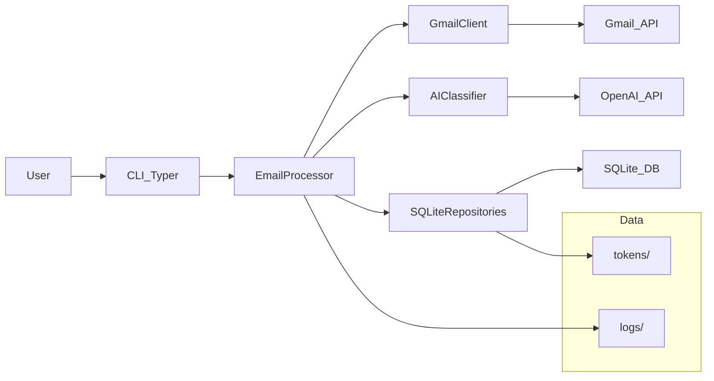

### MailPilot - AI-Powered Gmail Inbox Manager

MailPilot is a Python-based, AI-powered Gmail inbox manager. It connects to one or more Gmail accounts, periodically fetches new emails, classifies them using an LLM, and automatically applies labels and actions (archiving, flagging important messages) to keep your inbox organized.

## What MailPilot Does

MailPilot acts as an AI autopilot for your Gmail inbox.

It periodically scans new emails, classifies them using an LLM,
and safely applies Gmail labels and actions to keep your inbox organized.

Typical actions include:

- Label receipts automatically
- Archive promotions and newsletters
- Highlight important emails
- Categorize personal vs work messages

MailPilot is designed with safety-first automation:
it avoids destructive actions and tracks processed emails
to ensure idempotent behavior.

### Features

- **Multi-account Gmail support** via OAuth and the Gmail API.
- **AI-powered classification** using OpenAI, mapping emails into:
  - important
  - work
  - receipts
  - newsletters
  - promotions
  - personal
  - spam
- **Automatic actions**:
  - Apply Gmail labels per category.
  - Archive newsletters and promotions.
  - Flag important emails with an `IMPORTANT` / `mailpilot/important` label.
- **Idempotent processing** using SQLite to track processed messages and avoid duplicates.
- **Typer-based CLI** for running the processor, adding accounts, database checks, and summaries.
- **Safe senders** via environment variables so trusted addresses are not marked spam and are treated gently for archives.
- **Per-run caps** on archives, spam marks, and label changes to limit blast radius.
- **Graceful Gmail re-auth**: expired or revoked OAuth for one account skips that account only; others keep running, with a clear CLI summary.

### Architecture Overview

Core components live under the `mailpilot` package:

- `config` – loads configuration from environment / `.env`.
- `gmail_client` – facade for Gmail API (OAuth, labels, message fetch/modify).
- `ai_classifier` – OpenAI-based classifier with a clear interface (`Classifier`).
- `email_processor` – orchestrates fetch → classify → label per account.
- `scheduler` – runs processing once or in a loop.
- `database` – SQLite schema and repositories (`AccountRepository`, `ProcessedEmailRepository`).
- `models` – simple data models.
- `cli` / `main` – Typer CLI entrypoints.

Data and logs are stored under `data/`:

- `data/mailpilot.db` – SQLite database (configurable).
- `data/logs/` – log files.
- `data/tokens/` – reserved for future token storage strategies (currently tokens are stored in SQLite).

### Architecture Diagram



### Installation

- **Prerequisites**:
  - Python 3.11+ recommended.
  - A Google account with Gmail enabled.
  - An OpenAI API key.

1. Clone the repository:

```bash
git clone https://github.com/justinkemersion/mailpilot-ai.git mailpilot-ai
cd mailpilot-ai
```

2. Create and activate a virtual environment:

```bash
python -m venv .venv
source .venv/bin/activate
```

3. Install dependencies:

```bash
pip install -e ".[dev]"
```

This registers the **`mailpilot`** command on your PATH (same program as `python -m mailpilot.main`).

4. Copy and edit the environment file:

```bash
cp .env.example .env
```

Fill in `OPENAI_API_KEY` and `GOOGLE_CREDENTIALS_FILE` at minimum. All variables are documented in [Configuration (environment variables)](#configuration-environment-variables) and in [`.env.example`](.env.example).

### Invoking the CLI

Use either form (after install):

- **`mailpilot …`** — short; requires an activated venv or a PATH that includes the install location.
- **`python -m mailpilot.main …`** — explicit; reliable from the repo with `python` pointing at your venv.

```bash
mailpilot --help
# or
python -m mailpilot.main --help
```

Every subcommand below works with both prefixes.

### Configuration (environment variables)

| Variable | Required | Default | Purpose |
|----------|----------|---------|---------|
| `OPENAI_API_KEY` | Yes for `run`, `run-once`, and commands that load full app config | — | OpenAI API key for classification. |
| `GOOGLE_CREDENTIALS_FILE` | Yes for `add-account` | — | Path to Google OAuth **client** JSON (Desktop app type). |
| `MAILPILOT_DB_PATH` | No | `data/mailpilot.db` | SQLite database path. |
| `MAILPILOT_POLL_INTERVAL_SECONDS` | No | `300` | Default seconds between loops for `run` (overridden by `--interval`). |
| `MAILPILOT_LOG_LEVEL` | No | `INFO` | Logging level (`DEBUG`, `INFO`, …). |
| `MAILPILOT_OPENAI_MODEL` | No | `gpt-4.1-mini` | Model name for the classifier. |
| `MAILPILOT_ARCHIVE_SECURITY_NOISE` | No | off | Set to `1`, `true`, or `yes` to archive routine security “noise” (see CLI reference). |
| `MAILPILOT_ARCHIVE_RECEIPTS` | No | off | Set to `1`, `true`, or `yes` to archive receipts / transactional mail. |
| `MAILPILOT_SAFE_SENDER_DOMAINS` | No | empty | Comma-separated domains; matching senders skip spam and get gentler archive behavior. |
| `MAILPILOT_SAFE_SENDERS` | No | empty | Comma-separated full email addresses; same rules as domains. |
| `MAILPILOT_MAX_ARCHIVES_PER_RUN` | No | `30` | Maximum archive actions per run. |
| `MAILPILOT_MAX_SPAM_MARKS_PER_RUN` | No | `10` | Maximum spam label applications per run. |
| `MAILPILOT_MAX_LABEL_ACTIONS_PER_RUN` | No | `200` | Maximum Gmail label modifications per run. |

`db-check` does **not** require `OPENAI_API_KEY`; it only resolves `MAILPILOT_DB_PATH` (or the default DB path).

### Development

Run quality checks locally:

```bash
ruff check . --select E,F --ignore E501,F401
pytest -q
```

Optional type checking (not enforced in CI):

```bash
mypy mailpilot
```

GitHub Actions runs lint and tests on push and pull requests (see [`.github/workflows/ci.yml`](.github/workflows/ci.yml)).

If you prefer `requirements.txt`, it installs the editable package from `pyproject.toml`:

```bash
pip install -r requirements.txt
```

### Gmail API Setup

1. Go to the Google Cloud Console and create a project.
2. Enable the **Gmail API** for your project.
3. Configure an OAuth consent screen (External or Internal as appropriate).
4. Create OAuth 2.0 credentials of type **Desktop application**.
5. Under your OAuth client, ensure the **scope** used is (this is the only scope MailPilot needs):
   - `https://www.googleapis.com/auth/gmail.modify`
6. Download the client credentials JSON file and store it securely on your machine.
7. Set `GOOGLE_CREDENTIALS_FILE` in `.env` to the full path of that JSON file.

MailPilot uses the installed-app flow; when you run `add-account`, your browser opens for consent. Access and refresh tokens are stored in SQLite and are **refreshed automatically** while Google still accepts the refresh token.

**Testing mode and weekly re-consent:** On the **Testing** user type, Google typically expires refresh tokens after **about seven days**. When refresh fails, MailPilot **skips only the affected account(s)**, logs a clear error, and **continues with accounts that still authenticate**. After `run` or `run-once`, a **yellow** summary lists addresses that need sign-in again; run `add-account` once per address (re-adding updates the stored token for that email).

### OpenAI Setup

1. Create an OpenAI account if you do not have one.
2. Generate an API key from the OpenAI dashboard.
3. Set `OPENAI_API_KEY` in `.env`.
4. Optionally set `MAILPILOT_OPENAI_MODEL` in `.env` (see table above).

### CLI reference

Commands apply to **all active accounts** in the database unless Gmail authentication fails for some (those are skipped; see Gmail setup).

#### `add-account`

Runs the desktop OAuth flow and saves tokens to SQLite for the Google account you sign into.

```bash
mailpilot add-account
```

Requires `GOOGLE_CREDENTIALS_FILE` and a valid client secrets JSON.

#### `run-once`

Processes each active account once and prints a summary: accounts touched, inbox candidates, processed count, label/archive/spam counts. If any account needs re-auth, a **yellow** follow-up lists those emails and reminds you to run `add-account` again.

| Option | Description |
|--------|-------------|
| `--dry-run` | Classify and log what would happen; **no** Gmail label/archive changes. |
| `--newer-than-days N` | Adds `newer_than:Nd` to the search (with other built-in terms). |
| `--include-read` | Omits `is:unread` so read mail in INBOX is included. |
| `--query "..."` | Appends a raw Gmail query fragment (processing still targets INBOX). If the query has no date-style bound and no `is:unread`, you are prompted to confirm. |

Examples:

```bash
mailpilot run-once
mailpilot run-once --dry-run
mailpilot run-once --newer-than-days 30
mailpilot run-once --newer-than-days 30 --include-read
mailpilot run-once --query "from:boss@example.com newer_than:7d"
```

**Inbox defaults:** Unread-only in INBOX unless you change behavior with the flags above. **`--include-read` without `--newer-than-days`** prompts for confirmation (full INBOX scan risk).

#### `run`

Same processing as `run-once`, repeated forever (until SIGINT/SIGTERM), with a sleep between passes.

| Option | Short | Description |
|--------|-------|-------------|
| `--interval` | `-i` | Seconds between runs (default from `MAILPILOT_POLL_INTERVAL_SECONDS`). |
| `--dry-run` | | Same as `run-once`. |
| `--newer-than-days` | | Same as `run-once`. |
| `--include-read` | | Same as `run-once`. |
| `--query` | | Same as `run-once`. |

```bash
mailpilot run
mailpilot run --interval 120
mailpilot run --dry-run
```

#### `db-check`

Read-only check: integrity, foreign keys, per-account processed counts, duplicate/orphan signals. Exits with code **1** if the report is not OK.

```bash
mailpilot db-check
```

Does not require `OPENAI_API_KEY`.

#### `summarize`

Prints the most recent rows from processed email history (all categories), newest first.

| Option | Default | Description |
|--------|---------|-------------|
| `--limit` | `20` | Maximum rows to print. |

```bash
mailpilot summarize --limit 20
```

#### Optional behavior via `.env`

Archive and noise tuning (`MAILPILOT_ARCHIVE_SECURITY_NOISE`, `MAILPILOT_ARCHIVE_RECEIPTS`) and safe-sender / per-run caps are described in the [configuration table](#configuration-environment-variables).

### Example Cron Integration

Schedule `run-once` with cron or a systemd timer:

```cron
*/5 * * * * /path/to/venv/bin/python -m mailpilot.main run-once >> /var/log/mailpilot-cron.log 2>&1
```

If `mailpilot` is on the cron user’s PATH:

```cron
*/5 * * * * /path/to/venv/bin/mailpilot run-once >> /var/log/mailpilot-cron.log 2>&1
```

### Troubleshooting

- **Missing OpenAI API key**  
  Commands that load full config (`run`, `run-once`, `summarize`, …) require `OPENAI_API_KEY`. MailPilot shows a styled error panel with steps to add the key to `.env`.

- **Missing or invalid Gmail OAuth client file**  
  `add-account` needs `GOOGLE_CREDENTIALS_FILE` pointing at the **client** JSON. A friendly error panel explains how to create it in Google Cloud Console.

- **Gmail sign-in expired or revoked (multi-account)**  
  If one account’s token is bad (common weekly in OAuth **Testing** mode), that account is **skipped** for the run; others continue. Read the **yellow** lines after the run summary, then run `mailpilot add-account` and sign in for each listed address.

- **Privacy and logs**  
  Classifier parse failures are not logged with raw model text, but logs can still include addresses and processing metadata. Treat `data/logs/` as sensitive.

### Roadmap

- **Web dashboard** for viewing and adjusting classifications.
- **Rules engine** to combine AI classification with user-defined rules.
- **Additional providers** (Outlook, generic IMAP).
- **Improved observability** (metrics, tracing, richer logging).
- **Configurable models and prompts** per user or account.
