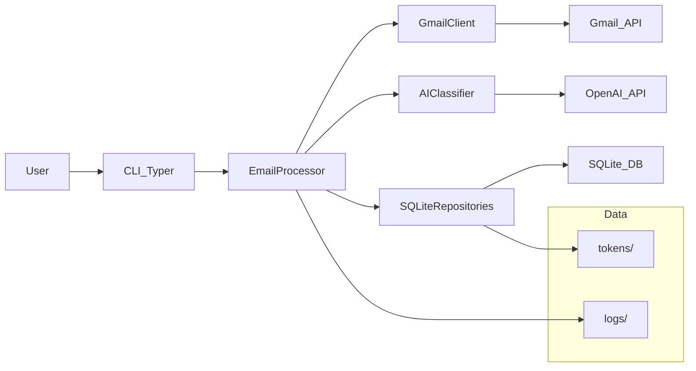

### MailPilot - AI-Powered Gmail Inbox Manager

MailPilot is a Python-based, AI-powered Gmail inbox manager. It connects to one or more Gmail accounts, periodically fetches new emails, classifies them using an LLM, and automatically applies labels and actions (archiving, flagging important messages) to keep your inbox organized.

### Features

- **Multi-account Gmail support** via OAuth and the Gmail API.
- **AI-powered classification** using OpenAI, mapping emails into:
  - important
  - work
  - receipts
  - newsletters
  - promotions
  - personal
  - spam
- **Automatic actions**:
  - Apply Gmail labels per category.
  - Archive newsletters and promotions.
  - Flag important emails with an `IMPORTANT` / `mailpilot/important` label.
- **Idempotent processing** using SQLite to track processed messages and avoid duplicates.
- **Typer-based CLI** for running the processor, adding accounts, and summarizing recent emails.

### Architecture Overview

Core components live under the `mailpilot` package:

- `config` – loads configuration from environment / `.env`.
- `gmail_client` – facade for Gmail API (OAuth, labels, message fetch/modify).
- `ai_classifier` – OpenAI-based classifier with a clear interface (`Classifier`).
- `email_processor` – orchestrates fetch → classify → label per account.
- `scheduler` – runs processing once or in a loop.
- `database` – SQLite schema and repositories (`AccountRepository`, `ProcessedEmailRepository`).
- `models` – simple data models.
- `cli` / `main` – Typer CLI entrypoints.

Data and logs are stored under `data/`:

- `data/mailpilot.db` – SQLite database (configurable).
- `data/logs/` – log files.
- `data/tokens/` – reserved for future token storage strategies (currently tokens are stored in SQLite).

### Architecture Diagram



### Installation

- **Prerequisites**:
  - Python 3.11+ recommended.
  - A Google account with Gmail enabled.
  - An OpenAI API key.

1. Clone the repository:

```bash
git clone <your-repo-url> mailpilot-ai
cd mailpilot-ai
```

2. Create and activate a virtual environment:

```bash
python -m venv .venv
source .venv/bin/activate
```

3. Install dependencies:

```bash
pip install -r requirements.txt
```

4. Copy and edit the environment file:

```bash
cp .env.example .env
```

Fill in `OPENAI_API_KEY` and `GOOGLE_CREDENTIALS_FILE` at minimum.

### Gmail API Setup

1. Go to the Google Cloud Console and create a project.
2. Enable the **Gmail API** for your project.
3. Configure an OAuth consent screen (External or Internal as appropriate).
4. Create OAuth 2.0 credentials of type **Desktop application**.
5. Download the client credentials JSON file and store it securely on your machine.
6. Set `GOOGLE_CREDENTIALS_FILE` in `.env` to the full path of that JSON file.

MailPilot uses the installed-app flow; when you run `add-account`, your browser will open and ask for consent. Tokens are stored in SQLite and refreshed automatically by the Google client libraries.

### OpenAI Setup

1. Create an OpenAI account if you do not have one.
2. Generate an API key from the OpenAI dashboard.
3. Set `OPENAI_API_KEY` in `.env`.

### Running MailPilot

All commands are invoked through the `main.py` entrypoint:

```bash
python -m mailpilot.main --help
```

- **Add a Gmail account**:

```bash
python -m mailpilot.main add-account
```

- **Run once (cron-friendly)**:

```bash
python -m mailpilot.main run-once
```

- **Run continuously with internal scheduler**:

```bash
python -m mailpilot.main run
```

Optionally override the polling interval:

```bash
python -m mailpilot.main run --interval 120
```

- **Summarize recent categorized emails**:

```bash
python -m mailpilot.main summarize --limit 20
```

### Example Cron Integration

Instead of using the internal scheduler, you can schedule periodic runs via cron or systemd timers by invoking `run-once`:

```cron
*/5 * * * * /path/to/venv/bin/python -m mailpilot.main run-once >> /var/log/mailpilot-cron.log 2>&1
```

### Roadmap

- **Web dashboard** for viewing and adjusting classifications.
- **Rules engine** to combine AI classification with user-defined rules.
- **Additional providers** (Outlook, generic IMAP).
- **Improved observability** (metrics, tracing, richer logging).
- **Configurable models and prompts** per user or account.
