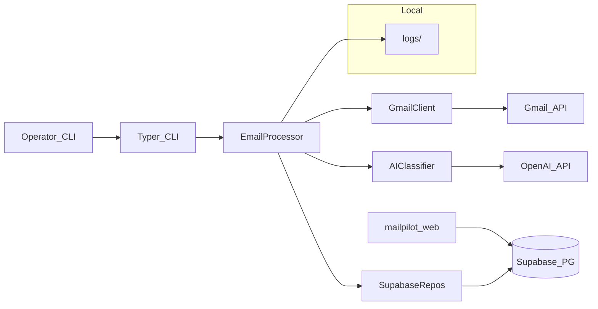

### MailPilot - AI-Powered Gmail Inbox Manager

MailPilot is a Python-based, AI-powered Gmail inbox manager. It connects to one or more Gmail accounts, periodically fetches new emails, classifies them using an LLM, and automatically applies labels and actions (archiving, flagging important messages) to keep your inbox organized.

> **Multi-tenant stack:** Accounts and processed-email history live in **Supabase** (PostgreSQL), populated by the **[`mailpilot-web`](../mailpilot-web/)** app (Gmail OAuth). This package is the **worker**: it reads tokens from Supabase, calls Gmail + OpenAI, and writes results back. For **why** the repo splits a Next.js app and a Python runner—and the pros and cons—read the [root `README.md`](../README.md#standalone-runner--web-app-why-this-pattern). To process runs triggered from the dashboard, use **`python -m mailpilot.main watch-jobs`** (see [CLI reference](#cli-reference)).

## What MailPilot Does

MailPilot acts as an AI autopilot for your Gmail inbox.

It periodically scans new emails, classifies them using an LLM,
and safely applies Gmail labels and actions to keep your inbox organized.

Typical actions include:

- Label receipts automatically
- Archive promotions and newsletters
- Highlight important emails
- Categorize personal vs work messages

MailPilot is designed with safety-first automation:
it avoids destructive actions and tracks processed emails
to ensure idempotent behavior.

### Features

- **Multi-account Gmail support** via OAuth and the Gmail API.
- **AI-powered classification** using OpenAI, mapping emails into:
  - important
  - work
  - receipts
  - newsletters
  - promotions
  - personal
  - spam
- **Automatic actions**:
  - Apply Gmail labels per category.
  - Archive newsletters and promotions.
  - Flag important emails with an `IMPORTANT` / `mailpilot/important` label.
- **Idempotent processing** using **Supabase** (`processed_emails`) to track processed messages and avoid duplicates.
- **Typer-based CLI** for running the processor, **Supabase checks**, summaries, **history with undo**, and **`watch-jobs`** (consumes `run_jobs` from the web app).
- **Safe senders** via environment variables so trusted addresses are not marked spam and are treated gently for archives.
- **Per-run caps** on archives, spam marks, and label changes to limit blast radius.
- **Graceful Gmail re-auth**: expired or revoked OAuth for one account skips that account only; others keep running, with a clear CLI summary.

### Architecture Overview

Core components live under the `mailpilot` package:

- `config` – loads configuration from environment / `.env`.
- `gmail_client` – facade for Gmail API (OAuth, labels, message fetch/modify).
- `ai_classifier` – OpenAI-based classifier with a clear interface (`Classifier`).
- `email_processor` – orchestrates fetch → classify → label per account.
- `scheduler` – runs processing once or in a loop.
- `persistence` – Supabase-backed repositories (`SupabaseAccountRepository`, `SupabaseProcessedEmailRepository`, `RunJobRepository`).
- `models` – simple data models.
- `cli` / `main` – Typer CLI entrypoints.

Gmail OAuth tokens and processed-email rows are stored in **Supabase** (see `mailpilot-web/supabase/schema.sql`). Local **logs** still go under `data/logs/` when the file handler is enabled.

### Architecture Diagram



### Installation

- **Prerequisites**:
  - Python 3.11+ recommended.
  - A Google account with Gmail enabled.
  - An OpenAI API key.

1. Clone the repository:

```bash
git clone https://github.com/justinkemersion/mailpilot-ai.git mailpilot-ai
cd mailpilot-ai
```

2. Create and activate a virtual environment:

```bash
python -m venv .venv
source .venv/bin/activate
```

3. Install dependencies:

```bash
pip install -e ".[dev]"
```

This registers the **`mailpilot`** command on your PATH (same program as `python -m mailpilot.main`).

4. Copy and edit the environment file:

```bash
cp .env.example .env
```

Fill in `OPENAI_API_KEY`, `SUPABASE_URL`, and `SUPABASE_SERVICE_ROLE_KEY` at minimum. Linking Gmail accounts is done in the **MailPilot web app**, not via CLI. Variables are summarized below and in [`.env.example`](.env.example).

### Invoking the CLI

Use either form (after install):

- **`mailpilot …`** — short; requires an activated venv or a PATH that includes the install location.
- **`python -m mailpilot.main …`** — explicit; reliable from the repo with `python` pointing at your venv.

```bash
mailpilot --help
# or
python -m mailpilot.main --help
```

Every subcommand below works with both prefixes.

### Configuration (environment variables)

| Variable | Required | Default | Purpose |
|----------|----------|---------|---------|
| `OPENAI_API_KEY` | Yes for `run`, `run-once`, `watch-jobs`, and most commands | — | OpenAI API key for classification. |
| `SUPABASE_URL` | Yes | — | Supabase project URL (same as web app’s project). |
| `SUPABASE_SERVICE_ROLE_KEY` | Yes | — | Service role key (**trusted machines only**; bypasses RLS). |
| `MAILPILOT_POLL_INTERVAL_SECONDS` | No | `300` | Default seconds between loops for `run` (overridden by `--interval`). |
| `MAILPILOT_LOG_LEVEL` | No | `INFO` | Logging level (`DEBUG`, `INFO`, …). |
| `MAILPILOT_OPENAI_MODEL` | No | `gpt-4.1-mini` | Model name for the classifier. |
| `MAILPILOT_ARCHIVE_SECURITY_NOISE` | No | off | Set to `1`, `true`, or `yes` to archive routine security “noise” (see CLI reference). |
| `MAILPILOT_ARCHIVE_RECEIPTS` | No | off | Set to `1`, `true`, or `yes` to archive receipts / transactional mail. |
| `MAILPILOT_SAFE_SENDER_DOMAINS` | No | empty | Comma-separated domains; matching senders skip spam and get gentler archive behavior. |
| `MAILPILOT_SAFE_SENDERS` | No | empty | Comma-separated full email addresses; same rules as domains. |
| `MAILPILOT_MAX_ARCHIVES_PER_RUN` | No | `30` | Maximum archive actions per run. |
| `MAILPILOT_MAX_SPAM_MARKS_PER_RUN` | No | `10` | Maximum spam label applications per run. |
| `MAILPILOT_MAX_LABEL_ACTIONS_PER_RUN` | No | `200` | Maximum Gmail label modifications per run. |

`supabase-check` does **not** require `OPENAI_API_KEY`; it only checks Supabase connectivity and table reachability.

### Development

Run quality checks locally:

```bash
ruff check . --select E,F --ignore E501,F401
pytest -q
```

Optional type checking (not enforced in CI):

```bash
mypy mailpilot
```

GitHub Actions runs lint and tests on push and pull requests (see [`.github/workflows/ci.yml`](.github/workflows/ci.yml)).

If you prefer `requirements.txt`, it installs the editable package from `pyproject.toml`:

```bash
pip install -r requirements.txt
```

### Gmail API Setup

OAuth **client IDs** (Web application type), redirect URIs, and the `gmail.modify` scope are configured for the **Next.js app**—see [`mailpilot-web/README.md`](../mailpilot-web/README.md). The runner only consumes **refresh tokens** already stored in Supabase.

**Testing mode and weekly re-consent:** In Google **Testing** mode, refresh tokens often expire after **about seven days**. When refresh fails, MailPilot **skips that account**, logs clearly, and continues with others. Reconnect the address in the web app (**Connect Gmail**).

### OpenAI Setup

1. Create an OpenAI account if you do not have one.
2. Generate an API key from the OpenAI dashboard.
3. Set `OPENAI_API_KEY` in `.env`.
4. Optionally set `MAILPILOT_OPENAI_MODEL` in `.env` (see table above).

### CLI reference

Commands apply to **all active accounts** in Supabase unless Gmail authentication fails for some (those are skipped; see Gmail setup). **Linking Gmail** is done in the MailPilot **web app** (`mailpilot-web`), not via CLI.

#### `watch-jobs`

Polls Supabase for **`run_jobs`** rows created by the dashboard’s **Process inbox** button, claims each job, runs the same processing pipeline as `run-once`, and writes status/results back. Keep this running locally or on a server while using the web UI to trigger runs.

```bash
python -m mailpilot.main watch-jobs
python -m mailpilot.main watch-jobs --poll-interval 10
```

#### `run-once`

Processes each active account once and prints a summary: accounts touched, inbox candidates, processed count, label/archive/spam counts. If any account needs re-auth, a **yellow** follow-up lists those emails and reminds you to run `add-account` again.

| Option | Description |
|--------|-------------|
| `--dry-run` | Classify and log what would happen; **no** Gmail label/archive changes. |
| `--newer-than-days N` | Adds `newer_than:Nd` to the search (with other built-in terms). |
| `--include-read` | Omits `is:unread` so read mail in INBOX is included. |
| `--query "..."` | Appends a raw Gmail query fragment (processing still targets INBOX). If the query has no date-style bound and no `is:unread`, you are prompted to confirm. |

Examples:

```bash
mailpilot run-once
mailpilot run-once --dry-run
mailpilot run-once --newer-than-days 30
mailpilot run-once --newer-than-days 30 --include-read
mailpilot run-once --query "from:boss@example.com newer_than:7d"
```

**Inbox defaults:** Unread-only in INBOX unless you change behavior with the flags above. **`--include-read` without `--newer-than-days`** prompts for confirmation (full INBOX scan risk).

#### `run`

Same processing as `run-once`, repeated forever (until SIGINT/SIGTERM), with a sleep between passes.

| Option | Short | Description |
|--------|-------|-------------|
| `--interval` | `-i` | Seconds between runs (default from `MAILPILOT_POLL_INTERVAL_SECONDS`). |
| `--dry-run` | | Same as `run-once`. |
| `--newer-than-days` | | Same as `run-once`. |
| `--include-read` | | Same as `run-once`. |
| `--query` | | Same as `run-once`. |

```bash
mailpilot run
mailpilot run --interval 120
mailpilot run --dry-run
```

#### `supabase-check`

Verifies `SUPABASE_URL` + `SUPABASE_SERVICE_ROLE_KEY` and that core tables are reachable. Does not require `OPENAI_API_KEY`.

```bash
python -m mailpilot.main supabase-check
```

#### `summarize`

Prints the most recent rows from processed email history (all categories), newest first.

| Option | Default | Description |
|--------|---------|-------------|
| `--limit` | `20` | Maximum rows to print. |

```bash
mailpilot summarize --limit 20
```

#### `history`

Search the **Supabase** log of what MailPilot has already processed (per Gmail account). The table includes a **Gmail message ID** column so you can copy an id and target a single message for `--undo` without querying the database by hand.

Undo uses the Gmail API to put the message back in the inbox (adds `INBOX` and `UNREAD`) and removes MailPilot-applied labels recorded for that row. Rows processed before undo metadata existed may only get inbox/unread restoration.

| Option | Default | Description |
|--------|---------|-------------|
| `--days-back` | `7` | Only rows with `processed_at` in the last *N* days (UTC). |
| `--limit` | `50` | Max rows shown (and max matched for `--undo`). |
| `--account-email` | — | Restrict to one linked account (e.g. your Gmail address). |
| `--sender` | — | `LIKE` filter on stored sender. |
| `--subject` | — | `LIKE` filter on subject. |
| `--category` | — | Exact match on AI category. |
| `--action` | — | `LIKE` filter on human-readable actions (e.g. `archived`). |
| `--message-id` | — | Exact Gmail message id (best for undoing one message). |
| `--undo` | off | Reverse MailPilot’s recorded changes for all matched rows. If more than one row matches, you are prompted to confirm. |

**Example: skim recent history for one account, then undo one archived message**

1. List recent processed messages and note the **Gmail message ID** in the table (cyan column):

```bash
python -m mailpilot.main history \
  --account-email you@gmail.com \
  --days-back 30 \
  --limit 20
```

2. Undo MailPilot’s actions for that message (use a `--days-back` window that still includes the row, or use a large value such as `365`):

```bash
python -m mailpilot.main history \
  --account-email you@gmail.com \
  --message-id 'PASTE_GMAIL_MESSAGE_ID_HERE' \
  --days-back 30 \
  --undo
```

The same `mailpilot history …` form works if `mailpilot` is on your PATH.

#### Optional behavior via `.env`

Archive and noise tuning (`MAILPILOT_ARCHIVE_SECURITY_NOISE`, `MAILPILOT_ARCHIVE_RECEIPTS`) and safe-sender / per-run caps are described in the [configuration table](#configuration-environment-variables).

### Example Cron Integration

Schedule `run-once` with cron or a systemd timer:

```cron
*/5 * * * * /path/to/venv/bin/python -m mailpilot.main run-once >> /var/log/mailpilot-cron.log 2>&1
```

If `mailpilot` is on the cron user’s PATH:

```cron
*/5 * * * * /path/to/venv/bin/mailpilot run-once >> /var/log/mailpilot-cron.log 2>&1
```

### Troubleshooting

- **Missing OpenAI API key**  
  Commands that load full config (`run`, `run-once`, `summarize`, `history`, …) require `OPENAI_API_KEY`. MailPilot shows a styled error panel with steps to add the key to `.env`.

- **Gmail not linked**  
  If there are no rows in `accounts`, connect Gmail from the MailPilot web app first.

- **Gmail sign-in expired or revoked (multi-account)**  
  If one account’s token is bad (common weekly in OAuth **Testing** mode), that account is **skipped** for the run; others continue. Read the **yellow** lines after the run summary, then use **Connect Gmail** in the web app for each listed address.

- **Privacy and logs**  
  Classifier parse failures are not logged with raw model text, but logs can still include addresses and processing metadata. Treat `data/logs/` as sensitive.

### Roadmap

- **Rules engine** to combine AI classification with user-defined rules.
- **Additional providers** (Outlook, generic IMAP).
- **Improved observability** (metrics, tracing, richer logging).
- **Configurable models and prompts** per user or account.
- **Stronger job-queue semantics** (e.g. multi-worker claiming) as usage grows.
