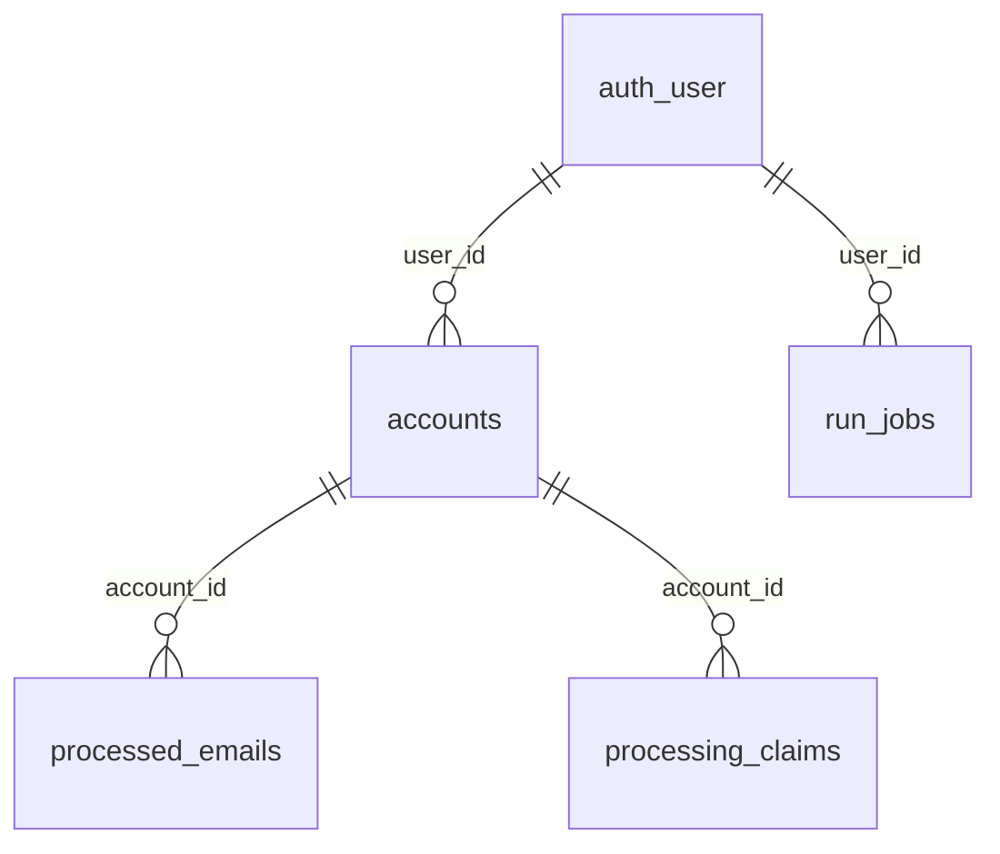
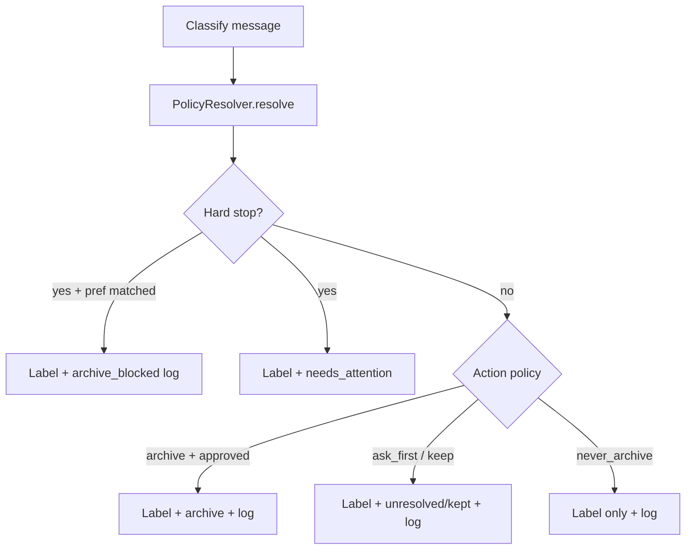

# MailPilot Phase 9 — Scoped Inbox Resolution

> Follow-up to [`mailpilot-phase-7-8-showcase-closure.md`](mailpilot-phase-7-8-showcase-closure.md) (UI showcase complete).
> **Status:** Phases A-G implemented; deploy Phase E-G migrations and runner to enable full behavior.
> **Revision:** 2026-06-17 — Phase D reconciliation after deployment.

**Goal:** MailPilot proposes what is safe to clear; the user teaches scoped rules per mailbox; security-sensitive mail never auto-archives by default.

**Core principle:** No automation without an audit trail.

---

## Revision summary (approved edits)

| # | Change |
|---|--------|
| 1 | Account-level `default_archive_policy` excludes `archive` — only `keep_inbox \| ask_first \| never_archive` |
| 2 | `mail_categories` uses partial unique indexes for nullable `account_id` |
| 3 | Audit (`mail_action_log`) foundation in Phases D/E; full audit UI in Phase F; cautious automation moved to Phase G |
| 4 | Undo semantics clarified — not Gmail snackbar window; best-effort INBOX restore |
| 5 | Dry-run policy preview required before Phase C behavior change |
| 6 | Explicit guard: no domain-only archive preferences for sensitive categories |
| 7 | `action_taken: archive_blocked` logged when a rule matched but hard stop prevented archive |
| 8 | Product term **resolution** with statuses: `unresolved`, `kept`, `archived`, `needs_attention`, `blocked` |

---

## 1. Current architecture findings

### 1.1 Stack and boundaries

| Layer | Technology | Key paths |
|-------|------------|-----------|
| Web (control plane) | Next.js 16 App Router, TypeScript, PostgREST via `fluxFetch` | [`mailpilot-web/`](mailpilot-web/) |
| Runner (engine) | Python 3.11, Gmail API, OpenAI/Cloudflare classifier | [`mailpilot-runner/`](mailpilot-runner/) |
| Database | PostgreSQL — Supabase `public` + Flux `api` schema (no ORM) | [`mailpilot-web/supabase/schema.sql`](mailpilot-web/supabase/schema.sql), [`flux/migrations/001_mailpilot_init.sql`](flux/migrations/001_mailpilot_init.sql) |
| Job queue | Postgres `run_jobs` + `watch-jobs` worker (not Bull/cron) | [`mailpilot-runner/mailpilot/scheduler.py`](mailpilot-runner/mailpilot/scheduler.py) |

Monorepo contract: web never runs routine processing; runner never handles browser OAuth. Undo is synchronous in web (`POST /api/undo`), not queued.

### 1.2 Existing data model (4 tables)



- **`accounts`** — Gmail OAuth tokens, `email`, `display_name`, `active`, `processing_enabled`. One row per `(user_id, email)`. This is already the mailbox key (`account_id`).
- **`processed_emails`** — One row per classified message; denormalized `user_id`; stores `category` (free TEXT), `was_archived`, `applied_label_names` (JSON string), `actions_taken` (unstructured text). Unique `(account_id, gmail_message_id)`.
- **`processing_claims`** — Per-message concurrency lock.
- **`run_jobs`** — Manual sync queue with `options` JSONB (`newer_than_days`, `include_read`, `dry_run`).

**Gaps vs target:** No persisted categories, action policies, scoped preferences, safety tiers, or structured audit. Rules live in code and env vars.

### 1.3 Labeling and archive behavior today

Pipeline: `POST /api/run` → `watch-jobs` → `EmailProcessor.process_all_accounts_once(user_id)` → per account: `ensure_labels` → list **INBOX** messages → classify → `_apply_actions` → persist.

**Categories** (hardcoded in [`ai_classifier.py`](mailpilot-runner/mailpilot/ai_classifier.py) `VALID_CATEGORIES` and [`categories.ts`](mailpilot-web/lib/categories.ts)): `important`, `work`, `personal`, `newsletters`, `promotions`, `receipts`, `spam`.

**Gmail labels** ([`gmail_client.py`](mailpilot-runner/mailpilot/gmail_client.py) `REQUIRED_LABEL_NAMES`): `work`, `receipts`, `newsletters`, `promotions`, `personal`, `mailpilot/important`, `security`.

**Archive matrix** ([`email_processor._apply_actions`](mailpilot-runner/mailpilot/email_processor.py) L656+):

| Category | Label | Archive today |
|----------|-------|---------------|
| `important` | `mailpilot/important` + IMPORTANT flag | Never |
| `work`, `personal` | category label | Never |
| `receipts` | `receipts` | Only if `MAILPILOT_ARCHIVE_RECEIPTS=1` (default off) |
| `newsletters` | `newsletters` (+ `security` if noise) | **Yes** (unless safe sender or cap) |
| `promotions` | `promotions` | **Yes** (unless safe sender or cap) |
| `spam` | SPAM | Never archived |

**Security routing:** LLM marks routine security as `noise_type=security`. Default maps to category `important` (keep). Env `MAILPILOT_ARCHIVE_SECURITY_NOISE=1` maps to `newsletters` (archivable).

**Safety today:** `SafeGmailClient` forbids delete/trash; env safe-sender lists; per-run caps; account pause via `processing_enabled`. **No tiered policy layer; no per-mailbox rules.**

**Pain point confirmed:** `work`, `personal`, `important`, and most `receipts` are labeled but left in INBOX. `newsletters`/`promotions` auto-archive — global, not scoped, and contradicts the new product principle.

### 1.4 UI today

| Route | Purpose |
|-------|---------|
| `/dashboard/overview` | Metrics, sync, activity preview |
| `/dashboard/accounts` | Connect/pause/disconnect Gmail |
| `/dashboard/activity` | Searchable history + undo per row |
| `/dashboard/settings` | Stub (demo preferences only) |

No email detail view, no cleanup/review screen, no real preference storage. Demo fixture [`DEMO_PREFERENCES`](mailpilot-web/lib/demo/fixtures.ts) previews work-device sign-in preference.

### 1.5 Tests today

- **Runner:** pytest in [`mailpilot-runner/tests/`](mailpilot-runner/tests/) — `test_email_processor.py`, `test_sender_safety.py`, `test_multi_account_isolation.py`.
- **Web:** Vitest on pure lib modules only; not in CI.

---

## 2. Product model: resolution, not archive

### 2.1 Core vocabulary

MailPilot resolves inbox state — archive is one resolution type, not the whole product.

| Term | Meaning |
|------|---------|
| **Resolution** | What happened (or should happen) to a labeled message in the inbox |
| **Category / label** | “What is this?” |
| **Action policy** | “What should happen?” (may differ from category default) |
| **Mailbox scope** | “Which inbox does this apply to?” (`account_id`) |

### 2.2 Resolution status (product-facing)

Stored on `processed_emails.resolution_status`:

```
unresolved | kept | archived | needs_attention | blocked
```

| Status | Meaning |
|--------|---------|
| `unresolved` | Labeled, still in INBOX, awaiting user or policy decision |
| `kept` | User or policy chose to keep in inbox (resolved without archive) |
| `archived` | Removed from INBOX (by user, Cleanup, or approved automation) |
| `needs_attention` | Tier 3 / hard-stop adjacent — requires human review |
| `blocked` | A rule matched archive intent but was blocked (see `archive_blocked` log) |

Cleanup screen groups **unresolved** messages by safety tier. “Resolved” mail drops off Cleanup regardless of whether resolution was archive or keep.

### 2.3 Action policy enum

Used on **categories** and **user-approved preferences** only — not as account-wide archive:

```
keep_inbox | archive | ask_first | nudge | never_archive
```

- **`keep_inbox`** — label only (new default for most categories)
- **`archive`** — label + remove INBOX (**only** on category override or user preference — never account fallback)
- **`ask_first`** — label + surface in Cleanup (Tier 2 default)
- **`nudge`** — keep in inbox but flag in Cleanup until resolved (Phase D treats like `ask_first`)
- **`never_archive`** — label + hard block archive automation (Tier 3)

### 2.4 Account-level fallback (restricted)

Account `default_archive_policy` is a **resolution posture**, not an archive switch:

```
keep_inbox | ask_first | never_archive
```

**`archive` is intentionally excluded.** Account-wide archive is too broad and could mean “anything unresolved can archive.” Archive exists only on specific categories (user-edited) or specific user-approved preferences.

### 2.5 Safety tiers

| Tier | Name | Default action posture | Examples |
|------|------|------------------------|----------|
| 1 | `safe_auto` | Propose archive in Cleanup; auto only after explicit scoped approval | newsletters, promotions, post-delivery shipping, labeled receipts |
| 2 | `review` | `ask_first` — Cleanup “Review before archive” | work device sign-ins, bank/card notices, bills, medical/admin |
| 3 | `never_auto` | `never_archive` — never auto-archive; may still label | password changed, recovery changed, payment failed, human reply |

**Hard-stop matcher** (`security_hard_stops.py`): checked before any archive. If matched → force `never_archive`, set `resolution_status=needs_attention` or `blocked`, log `archive_blocked` when a preference would have archived.

---

## 3. Proposed data model

### 3.1 Extend `accounts` (not separate `mailbox_scopes`)

Add scope columns directly to **`accounts`** (1:1 with connected Gmail). `accounts` is already the mailbox entity.

```sql
purpose              TEXT NOT NULL DEFAULT 'other'
                     CHECK (purpose IN ('personal','work_delivery','business','other')),
default_archive_policy TEXT NOT NULL DEFAULT 'ask_first'
                     CHECK (default_archive_policy IN ('keep_inbox','ask_first','never_archive')),
security_posture     TEXT NOT NULL DEFAULT 'standard'
                     CHECK (security_posture IN ('strict','standard','relaxed')),
scope_configured_at  TIMESTAMPTZ  -- NULL until user sets purpose
```

### 3.2 `mail_categories`

System seed rows per user. `account_id` nullable: `NULL` = global default; non-null = account-specific override.

```sql
CREATE TABLE mail_categories (
  id              BIGSERIAL PRIMARY KEY,
  user_id         UUID/TEXT NOT NULL,
  account_id      BIGINT REFERENCES accounts(id) ON DELETE CASCADE,  -- nullable
  slug            TEXT NOT NULL,
  name            TEXT NOT NULL,
  label_name      TEXT NOT NULL,
  default_action  TEXT NOT NULL DEFAULT 'keep_inbox',
  safety_tier     TEXT NOT NULL DEFAULT 'review'
                  CHECK (safety_tier IN ('safe_auto','review','never_auto')),
  enabled         BOOLEAN NOT NULL DEFAULT TRUE,
  created_at      TIMESTAMPTZ NOT NULL DEFAULT NOW(),
  updated_at      TIMESTAMPTZ NOT NULL DEFAULT NOW()
);

-- Postgres NULL uniqueness: partial indexes required
CREATE UNIQUE INDEX mail_categories_global_unique_idx
  ON mail_categories (user_id, slug)
  WHERE account_id IS NULL;

CREATE UNIQUE INDEX mail_categories_account_unique_idx
  ON mail_categories (user_id, account_id, slug)
  WHERE account_id IS NOT NULL;
```

**Seed mapping** (preserve existing labels):

| slug | label_name | safety_tier | default_action |
|------|------------|-------------|----------------|
| important | mailpilot/important | never_auto | keep_inbox |
| work | work | review | keep_inbox |
| personal | personal | review | keep_inbox |
| newsletters | newsletters | safe_auto | ask_first |
| promotions | promotions | safe_auto | ask_first |
| receipts | receipts | safe_auto | ask_first |
| spam | SPAM | never_auto | never_archive |
| work_device_sign_in | security/work-device-sign-in | review | ask_first |

**Preference resolution order:** hard-stop → account preference (most specific) → account category override → global category default → account `default_archive_policy` fallback → **`keep_inbox`**.

### 3.3 `mail_preferences`

Always scoped to `account_id` (NOT NULL).

```sql
CREATE TABLE mail_preferences (
  id                    BIGSERIAL PRIMARY KEY,
  user_id               UUID/TEXT NOT NULL,
  account_id            BIGINT NOT NULL REFERENCES accounts(id) ON DELETE CASCADE,
  match_type            TEXT NOT NULL
                        CHECK (match_type IN ('sender','sender_domain','subject_pattern','category','composite')),
  match_conditions_json JSONB NOT NULL,
  category_id           BIGINT REFERENCES mail_categories(id),
  action_policy         TEXT NOT NULL,
  confidence_threshold  REAL DEFAULT 0.0,
  source                TEXT NOT NULL DEFAULT 'user'
                        CHECK (source IN ('user','system_seed')),
  enabled               BOOLEAN NOT NULL DEFAULT TRUE,
  created_at            TIMESTAMPTZ NOT NULL DEFAULT NOW(),
  updated_at            TIMESTAMPTZ NOT NULL DEFAULT NOW()
);
CREATE INDEX mail_preferences_account_enabled_idx ON mail_preferences (account_id) WHERE enabled;
```

#### Broad-preference guardrails (enforced in API + runner)

**Do not create `action_policy=archive` preferences from `sender_domain` alone** when the category is (or maps to) any of:

- security / account-access (including `work_device_sign_in`, `important`)
- billing / banking / payment
- work / legal / medical / government

For work-device sign-in, require **composite** match only:

```json
{
  "sender_domain": "accounts.google.com",
  "subject_contains": ["new sign-in", "new device"],
  "category_slug": "work_device_sign_in"
}
```

**Reject** domain-only patterns like `{ "sender_domain": "google.com" }` for archive preferences.

Teach flow defaults to composite match derived from the source message. UI shows a confirmation when match breadth exceeds threshold.

### 3.4 `mail_action_log`

Append-only audit. **Required before any automated archive.**

```sql
CREATE TABLE mail_action_log (
  id                  BIGSERIAL PRIMARY KEY,
  user_id             UUID/TEXT NOT NULL,
  account_id          BIGINT NOT NULL REFERENCES accounts(id) ON DELETE CASCADE,
  processed_email_id  BIGINT REFERENCES processed_emails(id),
  gmail_message_id    TEXT NOT NULL,
  gmail_thread_id     TEXT,
  category_id         BIGINT REFERENCES mail_categories(id),
  preference_id       BIGINT REFERENCES mail_preferences(id),
  action_taken        TEXT NOT NULL,
  reason_json         JSONB NOT NULL,
  previous_state_json JSONB,
  created_at          TIMESTAMPTZ NOT NULL DEFAULT NOW()
);
```

**`action_taken` values:**

```
label | archive | keep | archive_blocked | undo_archive | teach | cleanup_archive | cleanup_keep
```

**`archive_blocked`** — rule or preference matched archive intent but hard stop prevented it:

```json
{
  "action_taken": "archive_blocked",
  "reason_json": {
    "matched_preference_id": 42,
    "intended_policy": "archive",
    "block_reason": "hard_stop_password_changed",
    "summary": "Recognized as similar to your work sign-in rule, but did not archive because it mentioned password recovery."
  }
}
```

**`reason_json` shape** (stable UI contract):

```json
{
  "account_email": "justinemteramz@gmail.com",
  "account_purpose": "work_delivery",
  "category_slug": "work_device_sign_in",
  "matched_preference_id": 42,
  "policy_applied": "archive",
  "safety_tier": "review",
  "confidence": 0.92,
  "hard_stop_checked": true,
  "summary": "Matched rule: Routine work device sign-in"
}
```

Keep `processed_emails.actions_taken` for backward compatibility during transition.

### 3.5 `processed_emails` extensions

```sql
proposed_action       TEXT,           -- resolved policy at process time
resolution_status     TEXT NOT NULL DEFAULT 'unresolved'
                      CHECK (resolution_status IN ('unresolved','kept','archived','needs_attention','blocked')),
inbox_status          TEXT DEFAULT 'unknown'
                      CHECK (inbox_status IN ('in_inbox','archived','unknown')),
category_id           BIGINT REFERENCES mail_categories(id)
```

- **`resolution_status`** — product state (Cleanup, Activity, audit copy)
- **`inbox_status`** — technical Gmail INBOX presence; refreshable from Cleanup via Gmail API

---

## 4. Migration strategy

### 4.1 Dual-schema parity

Every migration in both Supabase (`mailpilot-web/supabase/migrations/`) and Flux (`flux/migrations/002_*.sql`). Keep RLS pattern `"tablename: select own"`.

### 4.2 Phased migration steps

1. Add columns/tables — idempotent DDL.
2. Backfill — seed `mail_categories`, map `processed_emails.category_id`, default accounts to `purpose='other'`, `default_archive_policy='ask_first'`, set existing labeled-not-archived rows to `resolution_status='unresolved'`.
3. Feature flag — `MAILPILOT_LEGACY_AUTO_ARCHIVE=1` preserves newsletters/promotions auto-archive until Phase G removes it. Default **off** after Phase C.
4. No destructive changes — keep `processed_emails.category` TEXT alongside `category_id`.

---

## 5. Runner / server changes

### 5.1 New modules

| Module | Responsibility |
|--------|----------------|
| `policy_resolver.py` | Resolve action; emit preview diff; log `archive_blocked` |
| `security_hard_stops.py` | Tier-3 pattern matching |
| `preference_matcher.py` | Match preferences; enforce broad-preference guards |
| `category_repository.py` | Load/seed categories |
| `action_logger.py` | Write `mail_action_log` rows |

### 5.2 Dry-run policy preview (before Phase C behavior change)

Before switching Gmail actions, add runner output (CLI flag `--policy-preview` and/or extended `dry_run` in sync):

```
Current behavior: newsletter → archived
New policy would be: newsletter → ask_first
Reason: safe_auto tier, no user-approved archive preference
Account: justinemteramz@gmail.com (work_delivery)
```

- Compare legacy `_apply_actions` vs `PolicyResolver` per message **without** Gmail modify.
- Include in `run_jobs.result` summary when `dry_run=true`.
- **Gate:** Phase C must not change live archive behavior until preview verified on a real sync dry-run.

### 5.3 Refactor `EmailProcessor`



### 5.4 Work-device sign-in rule (Phase G)

1. Detection: classifier prompt + rule shortcut → slug `work_device_sign_in`.
2. Default: Tier 2, `ask_first`, scoped to classifying account.
3. Hard stops: Tier-3 patterns → `important`, `never_archive`, `archive_blocked` if preference matched.
4. User approval: Cleanup “Always archive similar in this mailbox” → composite `mail_preferences` row.
5. Isolation: `account_id NOT NULL` enforced.

### 5.5 Web API routes

| Route | Method | Purpose |
|-------|--------|---------|
| `/api/accounts/[id]/scope` | PATCH | purpose, default_archive_policy, security_posture |
| `/api/categories` | GET | List categories |
| `/api/categories/[id]` | PATCH | Update default_action (account override) |
| `/api/cleanup/candidates` | GET | Unresolved messages grouped by safety tier |
| `/api/cleanup/actions` | POST | Bulk archive/keep/teach; writes action log |
| `/api/preferences` | GET/POST/PATCH | CRUD; validates broad-preference guards |
| `/api/messages/[processed_email_id]/teach` | POST | Per-message teach |
| `/api/action-log` | GET | Paginated audit trail |
| `/api/undo` | POST | Restore INBOX; log `undo_archive`; update `resolution_status` |

### 5.6 Undo semantics

Archive undo is **best-effort**: MailPilot can restore the `INBOX` label when the message still exists and Gmail access is still valid. This is **not** Gmail’s short post-action snackbar undo window.

- `POST /api/undo` continues to use `messages.modify` (add `INBOX`, remove applied labels).
- Log reversal in `mail_action_log` as `undo_archive`.
- No `reversible_until` column tied to Gmail claims; optional UI copy only if product wants a reminder window.

---

## 6. UI / UX plan

### 6.1 Navigation

Add to [`Sidebar.tsx`](mailpilot-web/components/Sidebar.tsx):

```
/dashboard/cleanup   → Cleanup (unresolved resolution queue)
/dashboard/settings  → mailbox scope + categories
```

Audit folded into Activity as filter tab (“Automated actions” / “Blocked”).

### 6.2 Screens

**A. Accounts** — purpose picker, security posture, resolution posture summary (not “archive policy”).

**B. Cleanup** — three groups: Safe to archive | Review before archive | Needs attention. Bulk: Archive | Keep (resolve as `kept`) | Always for this mailbox | Never auto-archive. Empty state: “Your inbox is caught up.”

**C. Activity — teach** — scoped teach menu; composite preference confirmation for archive rules.

**D. Settings** — per-mailbox category actions; advanced preferences list with disable/delete.

**E. Audit / explain** — “Why?” panel from `reason_json`; `archive_blocked` copy:

> “I recognized this as similar to your work sign-in rule, but did not archive it because it mentioned password recovery.”

Undo button + “Never do this again.”

---

## 7. Safety rules

### 7.1 Hard stops (never auto-archive)

Password changed, recovery changed, suspicious activity, account disabled, payment failed/overdue, human reply heuristics, urgency lexicon — all override preferences.

### 7.2 Automation gate (Phase G only)

Auto-archive **only when ALL true**:

1. Resolved policy = `archive`
2. No hard-stop match
3. User-approved preference OR user-edited category `default_action=archive` for that account
4. NOT blocked by `never_archive`
5. Within per-run archive cap
6. **`mail_action_log` write succeeds** (fail closed — no archive if log fails)

**Never** auto-archive on AI confidence alone.

---

## 8. Phased implementation sequence

### Phase A — Document and instrument (no behavior change)

- Baseline metrics: labeled-but-not-archived per category.
- Inventory env flags (`MAILPILOT_ARCHIVE_RECEIPTS`, `MAILPILOT_ARCHIVE_SECURITY_NOISE`, etc.).

**Acceptance:** Baseline documented; existing tests green.

### Phase B — Mailbox scopes on accounts

- Migration: `accounts` scope columns (restricted enum — no account-level `archive`).
- API: `PATCH /api/accounts/[id]/scope`.
- UI: purpose picker + first-connect prompt.
- Runner: load scope fields (no action change).

**Acceptance:** Scope saved per account; RLS isolated.

### Phase C — Categories + policy resolver + dry-run preview

- Migration: `mail_categories` (with partial unique indexes), `processed_emails.category_id`, `resolution_status`.
- Runner: `PolicyResolver` replaces hardcoded switch.
- **`--policy-preview` / dry-run diff** before enabling new live behavior.
- Feature flag `MAILPILOT_LEGACY_AUTO_ARCHIVE` for transition.
- Web: Settings category list.

**Acceptance:** Preview output verified; labels unchanged; with flag off, live archives drop to near-zero.

### Phase D — Cleanup screen + action log foundation

- Migration: `mail_action_log` table; `proposed_action`, `inbox_status` on `processed_emails`.
- API: cleanup candidates + manual bulk actions.
- UI: `/dashboard/cleanup`.
- **Log every manual Cleanup action** (`cleanup_archive`, `cleanup_keep`) to `mail_action_log`.

**Acceptance:** User resolves inbox manually with tier grouping; every Cleanup action audited.

### Phase E — Teach + preferences + blocked-event logging

- Migration: `mail_preferences`.
- API: teach endpoints with broad-preference validation.
- UI: teach menu on Activity.
- Runner: load preferences in resolver; log `archive_blocked` when preference matches but hard stop blocks (even before automation).
- Log teach events to action log.

**Acceptance:** Composite-only archive prefs for sensitive categories; `archive_blocked` rows appear in log.

### Phase F — Audit trail, explain UI, undo logging

- API: `GET /api/action-log`; extend undo to write log + update `resolution_status`.
- UI: explain panels, Activity audit filter, blocked/archive copy.
- Demo fixtures updated.

**Acceptance:** Every archive, keep, block, and undo has structured `reason_json`; user can answer “why did MailPilot do this?”

### Phase G — Cautious automation

> **Prerequisite:** Phase F complete. No automation without audit.

- Runner: auto-archive only for user-approved preferences; work-device sign-in flow.
- Remove or default-off `MAILPILOT_LEGACY_AUTO_ARCHIVE`.
- Hard-stop module fully active; fail closed if action log write fails.

**Acceptance:** Work mailbox approved sign-in rule archives routine matches; personal mailbox unaffected; hard stops log `archive_blocked` and never archive.

---

## 9. Testing checklist

### Runner (pytest)

- [ ] `test_policy_resolver_scoped_preference` — account A pref does not affect account B
- [ ] `test_hard_stops_prevent_archive` — Tier-3 never archived despite archive preference
- [ ] `test_archive_blocked_logged` — preference matched + hard stop → `archive_blocked` row
- [ ] `test_broad_preference_rejected` — domain-only archive pref for security category rejected
- [x] `test_account_fallback_no_archive` — covered by `test_account_fallback_never_archive`
- [ ] `test_category_partial_unique_indexes` — no duplicate global slugs per user
- [x] `test_policy_preview_dry_run` — covered by `test_policy_preview_detects_newsletter_change`
- [ ] `test_work_device_sign_in_composite_pref`
- [x] `test_legacy_auto_archive_flag` — covered by `test_newsletters_legacy_auto_archive`
- [ ] `test_action_log_required_before_auto_archive` — log failure prevents archive
- [x] Existing: `test_multi_account_isolation`, `test_sender_safety`, `test_email_processor`

### Web (Vitest)

- [ ] `resolutionPresentation.test.ts` — status labels, blocked copy
- [x] `cleanupCandidates.test.ts` — covered by `cleanup.test.ts` cleanup grouping and action normalization
- [ ] `preferenceGuard.test.ts` — broad-preference rejection rules

### Manual smoke

- [ ] Dry-run policy preview shows expected diffs before Phase C live switch
- [ ] Two accounts (work + personal); different purposes
- [ ] Cleanup resolves mail; action log entries for manual actions
- [ ] Teach creates composite pref only; domain-only rejected for security
- [ ] Phase G: approved rule archives on work account only
- [ ] Hard-stop message: `archive_blocked` in log, stays in inbox
- [ ] Undo restores INBOX; audit shows `undo_archive`
- [x] Production deploy smoke: web healthy, runner active, Flux health check OK, `/dashboard/cleanup` unauthenticated redirects, `/api/cleanup/candidates` returns 401 unauthenticated, demo Cleanup page renders expected tier headings.

---

## 10. Risks and mitigations

| Risk | Mitigation |
|------|------------|
| Users expect old newsletter auto-archive | `LEGACY_AUTO_ARCHIVE` flag; Cleanup CTA; onboarding copy |
| `inbox_status` stale | Refresh on Cleanup load |
| Preference too broad | Composite-only guard for sensitive categories; confirm UI |
| Automation before audit | Phase G blocked until Phase F complete; log fail-closed |
| Gmail rate limits on bulk Cleanup | Batch via `run_jobs`; cap per request |
| Classifier mislabels security | Hard stops + Tier 3 + `archive_blocked` transparency |

---

## 11. Explicit non-goals

- Global auto-archive by default
- Account-level `default_archive_policy = archive`
- Cross-mailbox preferences (`account_id` always required)
- Domain-only archive preferences for sensitive categories
- AI-only archive without user-approved preference
- Automation before audit trail exists
- User-editable hard-stop patterns (v1)
- Real-time Gmail push sync
- IMAP/non-Gmail providers

---

## 12. Key files

| Area | Paths |
|------|-------|
| Schema | `mailpilot-web/supabase/schema.sql`, `supabase/migrations/`, `flux/migrations/` |
| Runner | `email_processor.py`, `persistence.py`, new policy modules |
| Web | `Sidebar.tsx`, `cleanup/page.tsx`, `EmailActivityTable.tsx`, `ConnectedAccountCard.tsx`, `settings/page.tsx`, `app/api/` |
| Tests | `mailpilot-runner/tests/`, `mailpilot-web/lib/*.test.ts` |
| Docs | `BACKLOG.md`, `ARCHETECTURE.md` |

---

## 13. Success criteria

1. Labeled mail no longer feels stuck — Cleanup resolves inbox without unsafe defaults.
2. Work and personal inboxes behave independently; teach actions name the mailbox.
3. Security-sensitive patterns never auto-archive by default; blocks are visible in audit.
4. Every automated action is explainable; undo restores INBOX when Gmail allows.
5. Existing label application for all seven categories continues to work.
6. **No automation ships before audit trail is working.**

---

## Implementation progress

| Phase | Description | Status |
|-------|-------------|--------|
| A | Baseline instrumentation | done |
| B | Mailbox scopes on accounts | done |
| C | Categories + PolicyResolver + dry-run preview | done |
| D | Cleanup + action log foundation | done |
| E | Teach + preferences + archive_blocked logging | done |
| F | Audit UI, explain, undo logging | done |
| G | Cautious automation | done |

### Implemented commits

| Phase | Commit | Notes |
|-------|--------|-------|
| A | `3059fac` | Baseline labeled-not-archived metrics, archive-policy env inventory, plan creation. |
| B | `68bd8b1` | Account mailbox scope columns, scope API, account UI scope controls. |
| C | `8fdcdcb` | `mail_categories`, `PolicyResolver`, dry-run previews, legacy auto-archive flag, settings category defaults. |
| D | `4f5fb8d` | `mail_action_log`, Cleanup page, cleanup candidate/action APIs, manual archive/keep audit logging. |
| E | `edf296e` | `mail_preferences`, teach/preferences APIs, Activity teach menu, runner hard stops + `archive_blocked` logging. |
| F | `436b9d9` | `GET /api/action-log`, Activity audit tab, resolution badges, `undo_archive` audit logging. |
| G | `2d6ed17` | Preference-driven auto-archive with fail-closed `archive` action log; `work_device_sign_in` processor path. |
| H | `a1a764f` | Teach backfill + `teach_revert`, transparent 500-row scan metadata, Activity mailbox sort. |
| I | `23c6d9b` | Mailbox reconnect identity (`007`), soft disconnect, Flux-only runner health (`flux-check`). |

### Deployment notes

- Production is at commit `23c6d9b` (mailbox identity reconnect) as of `2026-06-19`; web container healthy, `mailpilot-runner` active.
- Flux migrations through `007_mailbox_identity.sql` applied on production (`001`–`007`; apply new files individually via `flux push` when needed).
- Flux CLI may still report a checksum conflict for baseline `001_mailpilot_init.sql`; apply new migrations individually with `flux push flux/migrations/00N_….sql`.
- `/etc/mailpilot/runner.env` includes `FLUX_API_URL` / `FLUX_SERVICE_TOKEN` (and often `NEXT_PUBLIC_FLUX_URL`); runner health: `flux-check`.
- **Supabase is retired** — schema mirror under `mailpilot-web/supabase/` is reference-only; production uses Flux `api` schema only.

### Current shipped behavior

- New policy default keeps newsletters/promotions/receipts in inbox as unresolved unless legacy auto-archive is enabled.
- Cleanup groups unresolved, non-archived processed mail by safety tier.
- Manual **Archive** removes `INBOX` via Gmail, updates `processed_emails.resolution_status='archived'`, and writes `mail_action_log.action_taken='cleanup_archive'`.
- Manual **Keep** updates `processed_emails.resolution_status='kept'`, keeps Gmail labels/inbox unchanged, and writes `mail_action_log.action_taken='cleanup_keep'`.
- **Teach** on Activity saves composite `mail_preferences` per mailbox and logs `teach` rows.
- **Phase H (web):** teach confirms with preview scan metadata (`scanned_count`, `scan_limit`, `truncated`, optional `total_candidate_count`); backfills up to 500 matching `processed_emails` per mailbox (DB-only); `POST /api/preferences/:id/revert-teach` restores rows and logs `teach_revert`; Activity sort by mailbox email (`sort=account_asc|account_desc`).
- Runner logs `archive_blocked` when a user archive preference matches but a hard stop blocks.
- **Phase G (runner):** auto-archive only when a user `archive` preference matches; writes `archive` to `mail_action_log` first (fail closed if log fails). Legacy auto-archive remains opt-in via `MAILPILOT_LEGACY_AUTO_ARCHIVE=0` default.

### Remaining work

- Optional: remove `MAILPILOT_LEGACY_AUTO_ARCHIVE` entirely after transition period.
- Optional: mailbox filter on Activity (sort by email is shipped; filter dropdown deferred).
- Optional: Flux `001` checksum ledger cleanup.
